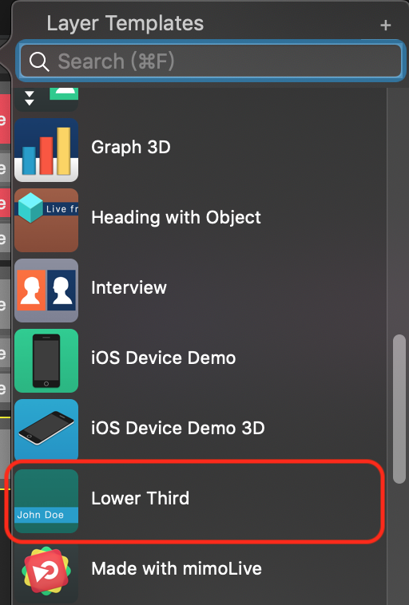
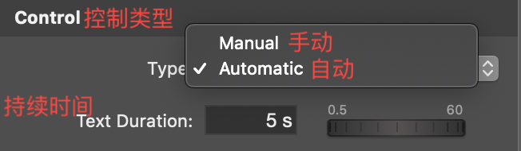
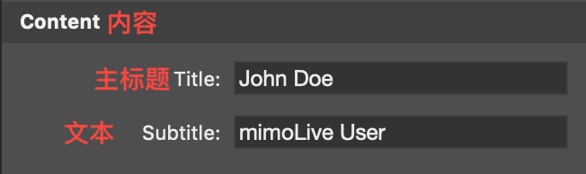
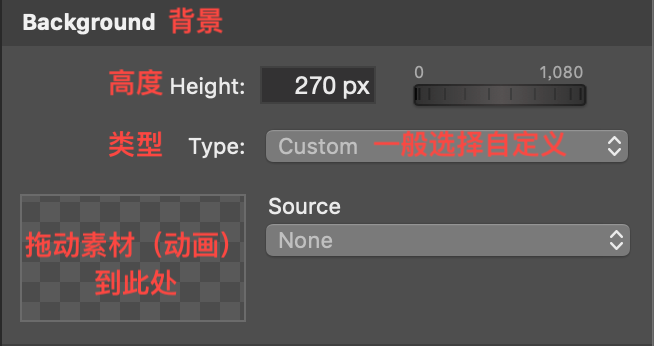
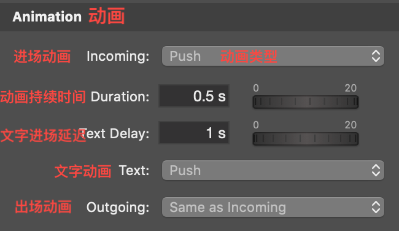
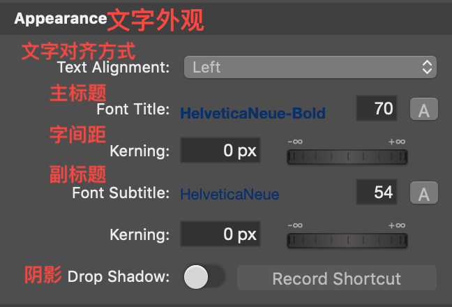
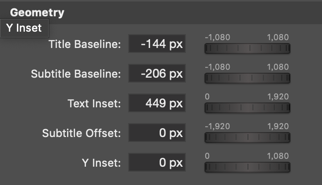
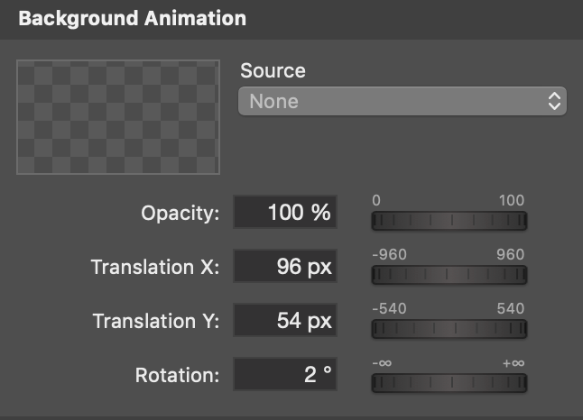
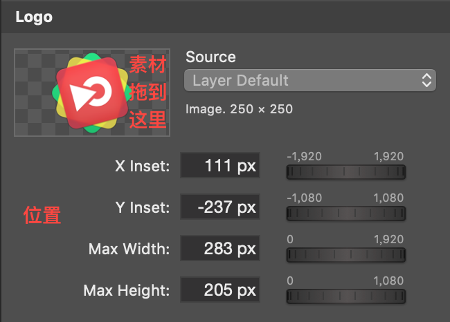

# 人名字幕条

## 添加

在图层区点击“+”按钮，添加“Lower Third”图层(拖拽或双击)。

## 参数调整

### 控制类型

可选择自动或手动模式

### 内容

### 背景

**注意**：由于背景素材的宽度不可调整，素材制作时应将素材宽度设为屏幕输出宽度，即为1080。

### 动画

### 文字外观

具体设置与[唱词](lyrics.md)相同。

### 位置

可以打开全屏预览拉动辅助线来调整位置，详见[唱词](lyrics.md)。

### 背景动画

一般选“**None**”。

### Logo

次处素材可放大缩小，位置同样可以通过拖动来调整。

### 模版

一个做好的字幕图层模版包含在模版文件中，详见[模版文件]()

## 播放控制

基本与[唱词](lyrics.md)相同。区别处在于，当控制类型为手动模式下，“**Live**”按钮为黄色时表示正在播放入场出场动画，此时再此按下“**Space**”即可结束进场/出场动画。

