#唱词

##添加

在图层区点击“+”按钮，添加“Static Text”图层(拖拽或双击)。

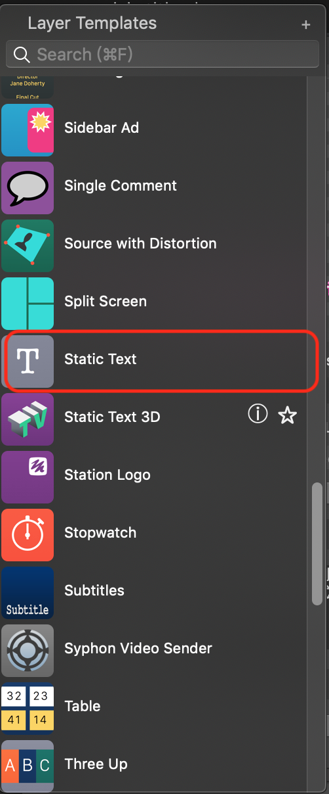

## 参数调整

### 文本内容与动画设置

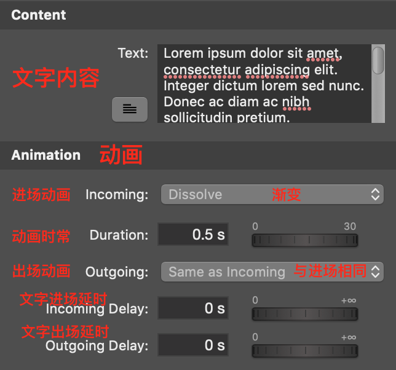

### 字体外观

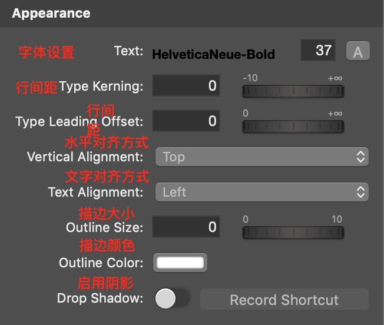

点击右侧“A”按钮完成具体字体设置

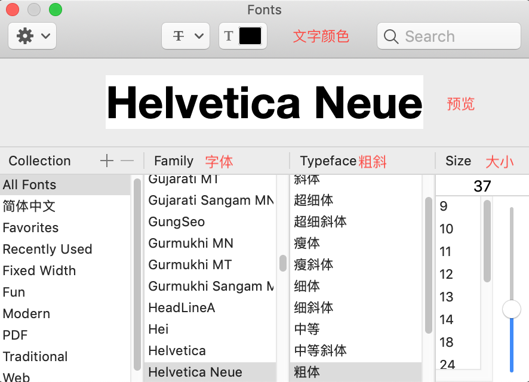

### 位置

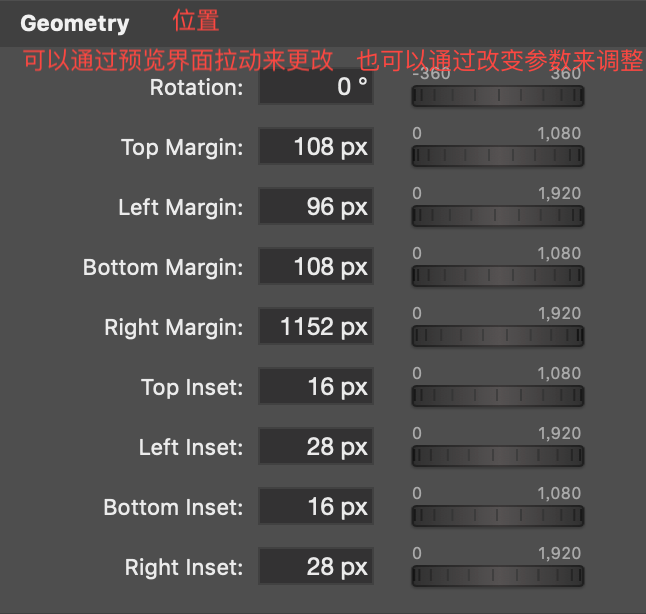

点击预览窗口右上角放大按钮，在全屏预览拉动辅助线调整具体位置

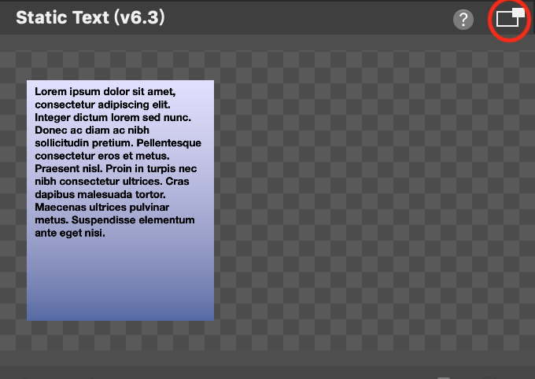

全屏预览

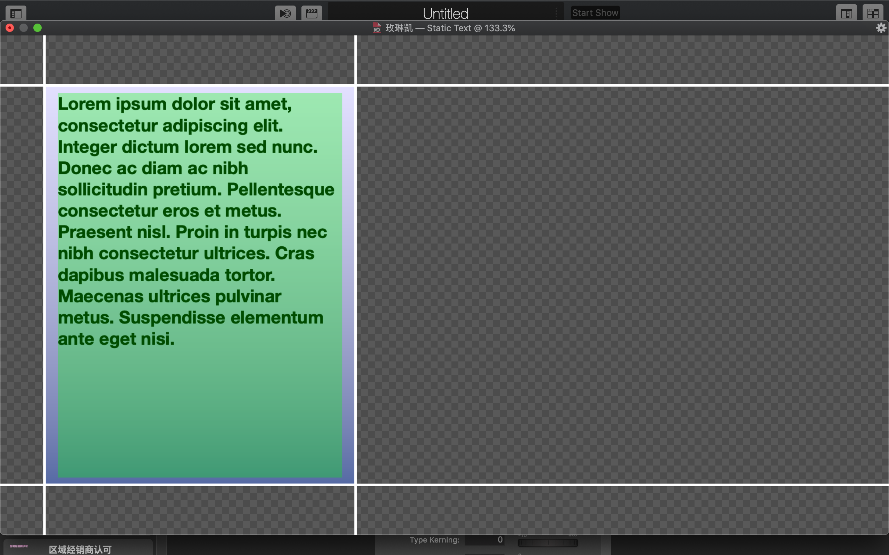

### 背景

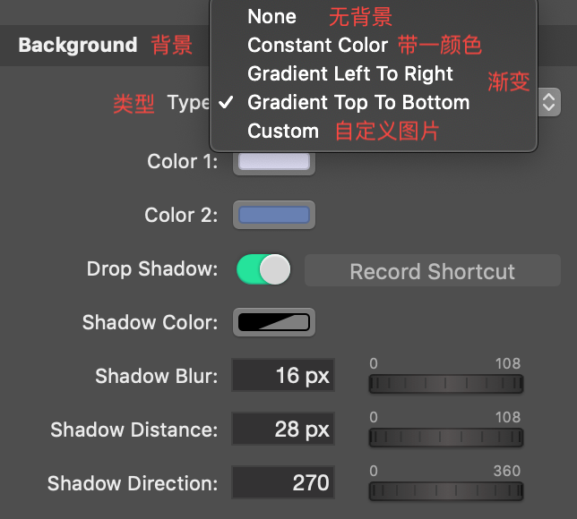

一般常用背景类型为“None”或“Custom”，“Custom”类型下可拖动右侧素材区素材到此处。

### 模版

一个做好的字幕图层模版包含在模版文件中，相见[模版文件]()

## 播放控制

### 添加变种

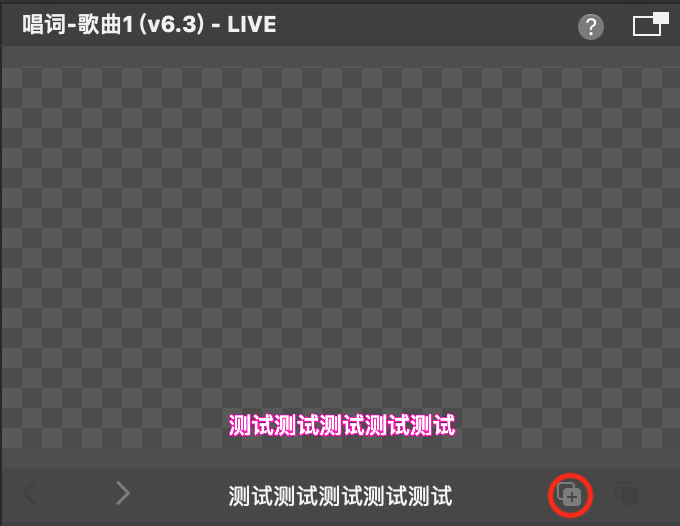

点击右下角按钮添加变种。

变种的所有参数与主图层一致，只需要修改文本内容。

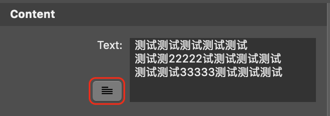

点击图中按钮，在弹出的文本框内修改文本。一般一行文字对应一个变种（比如一首歌的每句歌词对应一个变种），将所有内容逐一添加到变种。

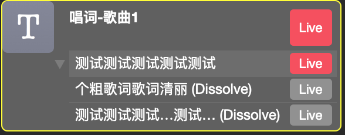

左侧图层区内该图层会包含所有的变种。双击图层或变种的标题可以更改该对象的标题（内容不变）。

### 控制

除了鼠标点选，还可以通过键盘左右方向键 **←**（上一个） **→**（下一个） 切换变种图层。　

空格键 “**Space**” 可以触发播放/停止，当“**Live**”按键为红色时表示正在播放。

播放一首歌时，先选中第一个图层，按下**Space**，然后按下**→**选中下一个变种图层，再按下**Space**播放，循环此操作至播放结束。