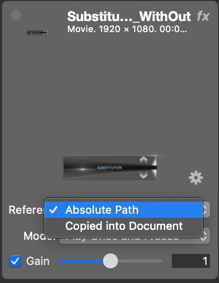
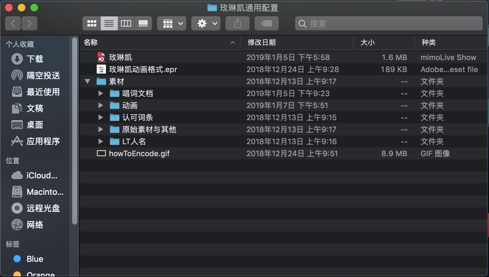
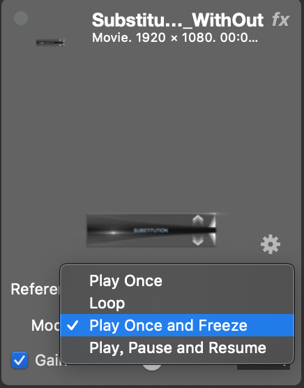
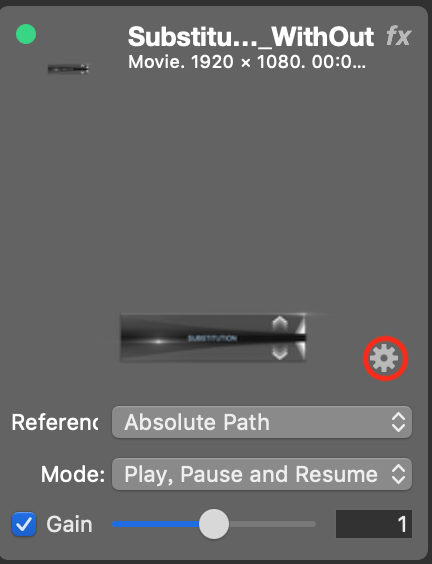
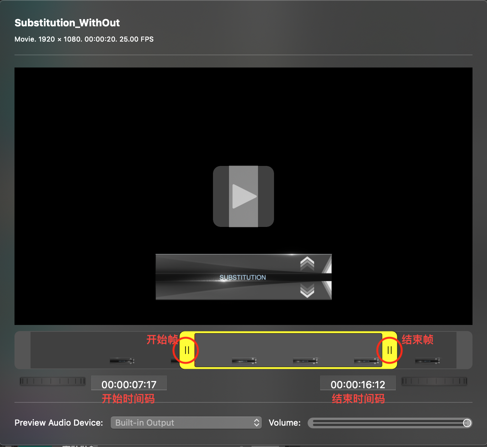

# 素材关联

## 两种引用模式

素材导入文档可以有两种引用模式：拷贝到文档 **"Copied into Document"** 和 路径引用**"Absolute Path"**。

#### 在不同情况下选择不同模式：

**拷贝到文档**：素材文件较小时，不需要再修改的素材，工程文档需要多人间分享时

**引用路径**：素材文件较大时，素材文件后续可能需要使用其他软件频繁修改时，不需要与他人分享时

&nbsp;

一般情况下，选择路径引用模式，这样素材的改动并不需要重新导入，只需要重启该工程文档即可同步更新。建议在某一路径下建立工程文件夹，将素材和文档统一存储和管理起来。例如下图：

**需要注意的是**：由于mimolive引用的是绝对路径，整个工程文件夹的位置一旦确定就不要改动。

## 四种播放模式

**Play Once**：单次播放并播放完后消失

**Loop**：循环播放

**Play Once and Freeze**：单次播放并停在最后一帧

**Play, Pause and Freeze**：控制播放模式（目前不使用）

## 选择多个素材

选中一个素材，按住 **command⌘**再选择其他需要多选的素材。

选中一个素材，按住**Shift⇧**再选择另一素材，此时两素材之间的所有素材都会被选中。

## 素材重命名

双击素材名称

## 素材折叠/展开

选中需要折叠/展开素材，右键 **"Collapse/Expand Source"**

## 素材组

极大方便素材的分类，选择添加素材 **"Source Group"** 或 选中多个需要归组素材右键选择 **"New Group with Selections"**

## 选取视频素材的一部分播放

> 注：此功能需要4.6版本及以上

点击图中按钮

拖拽选择开始帧和结束帧。选择需要播放的范围。

