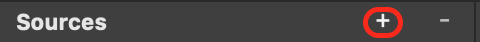
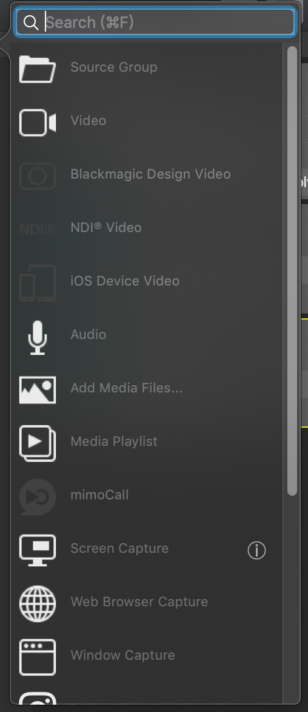

#输入与输出

## 输入

在左侧资源区顶部点击“+”按钮，弹出输入选择框。

####以下为常用输入：

* **Video**：视频文件

* **Blackmagic Design Video**：Blackmagic 采集卡

* **NDI Video**：NDI视频

* **Audio**：音频文件

* **Media Files**：图片

* **Media Playlist**：音频播放列表

## 输出

在右侧输出区顶部点击“+”按钮，弹出输出选择框。

#### 以下为常用输出：

* **File Recordeing**：录像到本地（采集）

* **Blackmagic Design**：放像或字幕Key/Fill输出

* **NDI**：NDI输出

##Keymode字幕输出

1. 通过Thunderbolt接口连接带双路SDI out的Blackmagic采集/回放设备，并将Blackmagic设备设置为Key/Fill模式

2. "**Output**"处选择添加"**Blackmagic Design**"
3. 按下图设置

