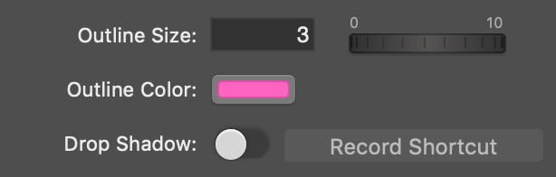

# 字体描边扩展的安装

找到以下文件

> *Static Text.tvlayer*
>
> *Lower Third.tvlayer*
>
> *Subtitles.tvlayer*

[字体描边下载](../resource/Static Text.tvlayer.zip)

并打开

此时打开/新建任意项目，以上三个图层已经有描边选项 

> 注：在4.6以上版本已经自带描边，4.6以下版本需要手动安装