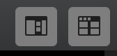

# 主界面

## 1 素材区

存放所有素材，包括图片，视频，输入信号等。

## 2 图层区

每个字幕都是单一图层。排列在上的图层会覆盖排列在下的图层。

“**Live**”按钮控制单一字幕条和其变种的播放。红色是表示正在播放。

## 3 参数区

设置字母的参数 如：位置，大小，使用的素材等。

此区域可添加/删除字幕**变种**图层。

此区域可为字幕条及其变种设置触发快捷键。

## 4 输出区

添加/删除输出，详见[输入与输出](inputOutput.md)

## 5 预览

预览输出内容

## 6 状态栏

隐藏/展开素材区

打开浏览器控制播放界面，详见

项目信息窗口，可修改项目参数

节目总开关，注意：**每次输出前需要触发，否则没有画面**

多屏监看