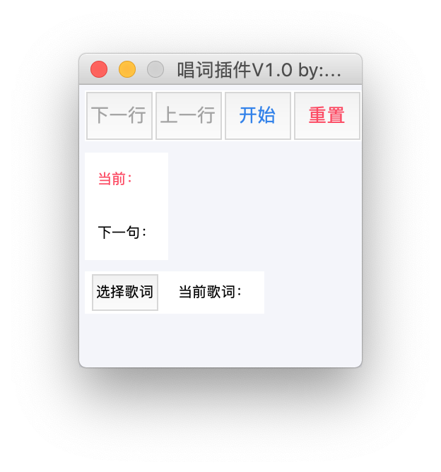

# 环境配置

## 下载插件

[下载地址](<https://github.com/MarioLinJueSheng/mimoScript/releases>)

> 下载 -- mimoScript.zip

解压mimoScript文件夹到桌面

## 安装配置Python

插件基于python3，需要现在运行的mac上安装pyhton3环境。

[官网下载页面](https://www.python.org/downloads/mac-osx/)

选择Stable Releases下的最新版本

> Download macOS 64-bit installer

更多环境配置参考[以下教程](https://www.runoob.com/python3/python3-basic-syntax.html)

## 配置Python启动器

安装完成后，打开Launchpad，打开Python Launcher。在默认弹出的Preferences窗口中将Python Script和Pyhton GUI Script均按下图设置。

## 设置启动方式

找到插件文件夹下 **/mimoScript/setup.py**，右键→打开方式→其他，选择应用程序→Python 3.7→Python Launcher，勾选"始终以此方式打开"，点击确认。

至此，弹出以下窗口，即代表插件正常运行

