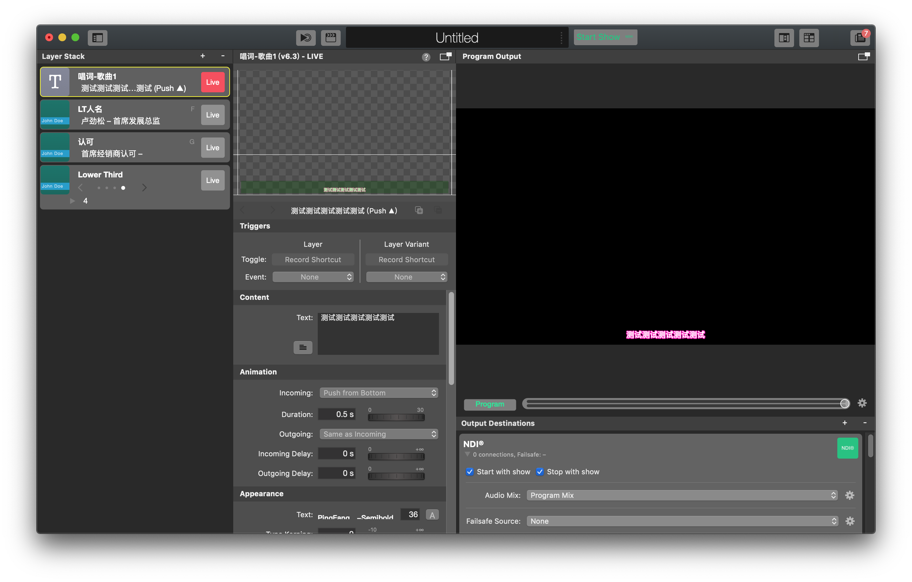
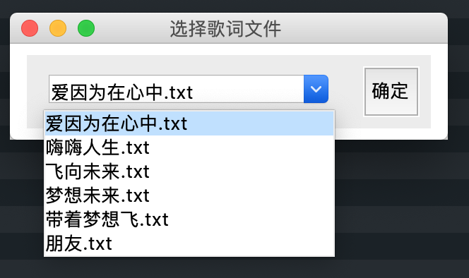
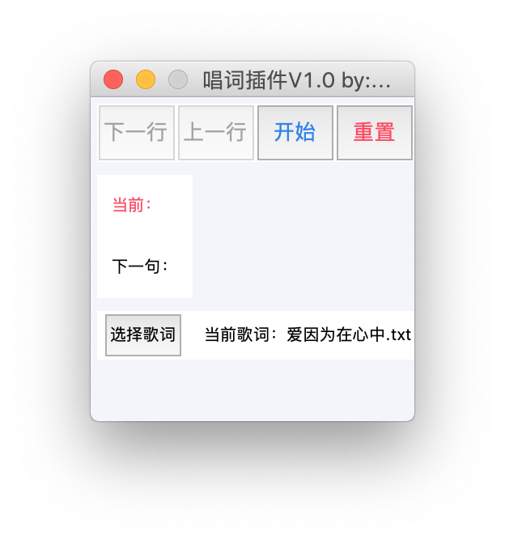
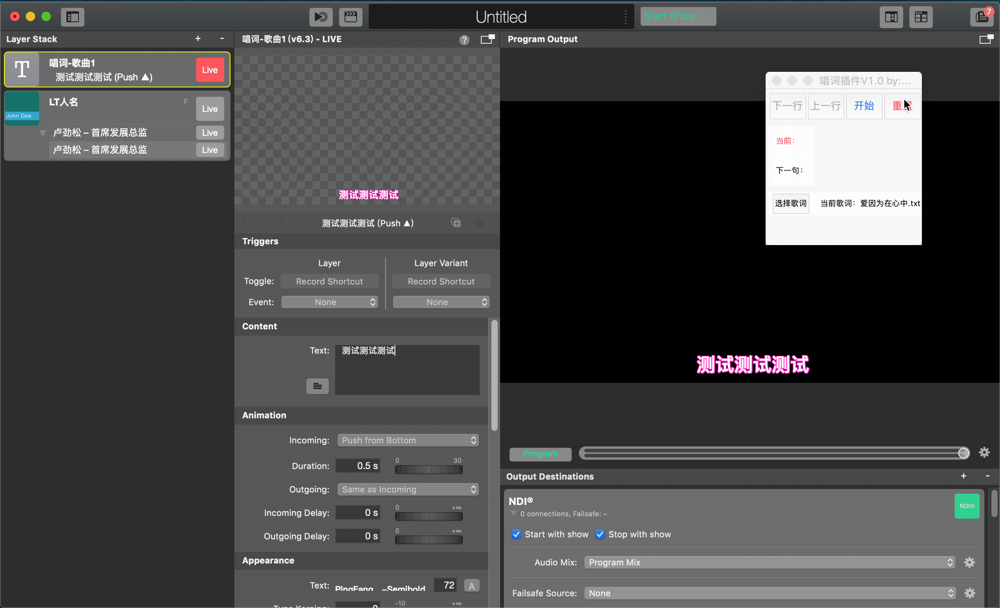

# 使用方法

**使用前请先阅读 [5.3 注意事项](pluginAttention.md)**

## 文件含义

- **content.txt** — 当前载入的歌曲文件（不需要用户改动）
- **read.txt** — 当前读取行歌词（不需要用户改动）
- **setup.py** — 插件主程序
- **songList文件夹** — 歌词保存文件夹

## songList文件夹

将所有歌词文档存放在此目录下： **/mimoScript/songList**。文件格式为.txt。

> **注意：所有的txt文档必须是utf-8格式编码。这意味着，一定不要使用Windows自带的文本编辑器来生成这些歌词文档，使用MacOS自带的文本编辑器或其他高级文本编辑器来编辑和修改这些文档。**

## 创建mimoLive歌词图层并配置样式

打开mimoLive，创建新的Text Layer，并配置样式（大小、位置、描边、颜色等）。详见 **[2.1 唱词](../Ch2/lyrics.md)**。只需要添加一个图层，不需要添加额外Variant。如下图：

## 插件选择歌词

打开插件，点击选择歌词，在弹出的窗口中选择，选中的歌词名称会在插件主界面显示：

## 播放控制

1. 点击"重置"按钮将内容清空
2. 点击mimoLive中"Live"输出该图层
3. 点击"开始"按钮加载选中歌词的第一行
4. 点击"下一行"或"上一行"按钮进行切换控制
5. 完成后再次点击"重置"清空

过程如下：

## 快捷键

下一行：**Space**

上一行：**P**

